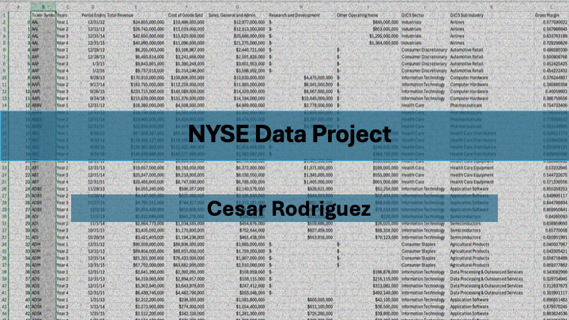

# NYSE Data Analysis Project

## Project Preview

## Overview
Excel-based analysis of NYSE financial data including revenue, expenses, and profitability trends.

## Tools Used
- Excel (Pivot Tables, Formulas, Data Cleaning)
- PowerPoint (Presentation)

## Key Work
- Cleaned and structured financial data
- Built pivot tables to analyze company performance
- Evaluated revenue and expense trends
- Created presentation to communicate insights

## Key Insights
- Identified trends in revenue across industries
- Observed differences in profitability based on expense levels
- Highlighted sectors with stronger financial performance
## Files
- nyse_analysis.xlsx
- nyse_analysis_presentation.pptx

## Author
Cesar Rodriguez
